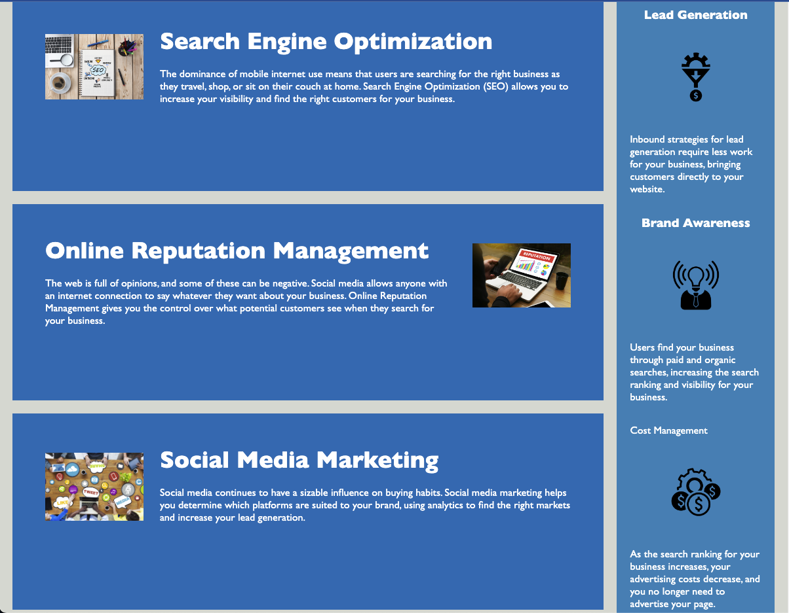

# Challenge-01 - Refactoring HTML

## Description
For this challenge, students were tasked with understanding how to practice the Scout's rule, which is to always leave a code better than when you were in it. 

Based on comments based on a previous submission mistakes, I learned to apply the following 
* Increased use of semantic HTML
* Ensuring proper linking of CSS file
* Correct use of octothorpe
* SEO and accessibility best practices include alt attributes and relevant title selection
* Consolidated selectors
* File comments

## Front end view

